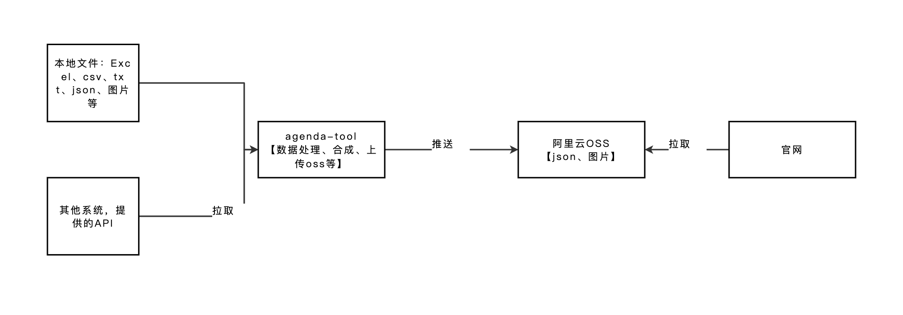

# 议程更新工具

## 系统架构介绍



## 部署

### 跳转到当前项目目录
```
cd 当前目录
```

### 环境变量
```
cp .env.example .env
```
### 修改 .env

- 这里按需求修改

### 如果你本地没有python环境，请参考
- windows系统：[docs/windows电脑如何安装python、pip.md](docs/windows电脑如何安装python、pip.md)

### 安装依赖库

```
pip install -r requirements.txt
```

## 执行
```
python main.py
```

## 项目目录介绍
```
- data/            # 存储结构化数据的文件夹，包含各种 jsonl 文件
- docs/            # 文档目录，包含各种说明文档和使用指南
- input/           # 输入数据目录
  - avatar/        # 专家头像图片目录，按分会场分类
  - expert/        # 专家信息Excel文件目录
  - report/        # 报告信息Excel文件目录
  - session/       # 分会场信息Excel文件目录
  - sponsor/       # 分会场赞助信息Excel文件目录
  - video/         # 视频信息Excel和CSV文件目录
- logs/            # 日志文件目录，记录程序执行日志
- model/           # 数据模型定义目录，包含各类数据模型的JSON Schema
- output/          # 输出数据目录
  - data/          # 处理后的数据输出目录
  - model/         # 输出数据模型目录
- public/          # 公共资源目录
  - images/        # 图片资源目录
- tasks/           # 任务脚本目录，按照编号顺序执行不同的数据处理任务
```

## 项目任务介绍

### 1. 本地数据清除
- `tasks` 文件夹下 `1_` 开头的文件的任务
- 清除本地数据，清除本地的 `data` 文件夹
- `data` 文件夹是这个项目设计的结构化数据的文件夹
- `data` 文件夹下的 `jsonl` 文件是这个项目设计的结构化数据的文件

### 2. 数据提取
- `tasks` 文件夹下 `100_` 开头的文件的任务
- 从 `input` 文件夹中读取数据
- `input` 文件夹是这个项目设计的输入数据的文件夹
- `input` 文件夹下的 `session`、`sponsor`、`video`、`expert`、`report` 文件夹是这个项目设计的输入数据的文件夹
- `input` 文件夹下的 `avatar` 文件夹是这个项目设计的输入专家头像数据的文件夹【仅支持png】
- 专家头像：【用户】根据固定规则，命名头像图片的文件名，并按照固定规则放在对应的文件夹下
- 专家头像：根据rbase的接口，拉取头像到本地
- 从【用户】提供Excel、CSV等数据中，提取出有用的信息变成可使用的数据
- 从API中拉取数据，提取出有用的信息变成可使用的数据
- 将提取出的数据，做一些处理，变成固定格式的数据，存在 `data` 文件夹下【jsonl数据，一条一条的】

### 3. 数据处理
- `tasks` 文件夹下 `200_` 开头的文件的任务
- 存在 `data` 文件夹下的 `jsonl` 文件的数据做一些数据处理，例如：
- 分会场：计算分会场的开始时间、结束时间、星期、日期、时间段等
- 分会场：根据分会场名称，生成分会场编码
- 专家：根据分会场名称、专家姓名，生成专家编码
- 视频：合并视频时长、视频权限、视频封面等到报告/壁报数据中

### 4. 数据输出
- `tasks` 文件夹下 `300_` 开头的文件的任务
- 将处理后的数据，输出到 `output/data` 文件夹下
- `output/data` 文件夹是这个项目设计的输出数据的文件夹
- 存在 `data` 文件夹下的 `jsonl` 文件的数据做一些数据合成，输出格式会参考 `output/model` 中的 json schema 文件，输出json格式的数据

### 5. 数据上传
- `tasks` 文件夹下 `1000_` 开头的文件的任务
- 将 `output/data` 文件夹下的 `json` 文件上传到阿里云
- 将 `output/data` 文件夹下的 专家头像图片上传到阿里云

### 特殊功能说明

#### rbase拉头像到本地
- 头像拉取到本地，使用rbase的接口，拉取头像到本地，并且会上传到阿里云

#### API拉取壁报数据
- 专门在投稿项目中做了壁报的相关接口，用于这里的数据拉取
- 目前拉取的壁报数据中，视频数据仅有阿里云视频ID，其他视频相关的需要人工维护

## 表结构介绍

#### 数据ID相关说明
- 分会场，分会场名称【唯一】，分会场编码【基于（分会场名称+meeting）生成base64编码，如果分会场名称变了，这个也变了】
- 专家，专家姓名【一个分会场里不能重名】，专家编码【分会场名称+专家姓名+meeting生成base64编码，不用，但是会生成】
- 报告，报告编码【运营自己填，唯一值，必填】
- 壁报，壁报编号【数据里自带，无需生成】
- 视频，阿里云视频地址【数据里自带，无需生成】

## 数据更新 ✅✅✅✅✅
### 前提
- 目前仅支持分会场、专家、报告、分会场赞助、视频数据人工维护
- 壁报数据从API中拉取，不需要人工维护，但是需要人工维护壁报中的视频数据
- 目前数据更新的形式是从input文件夹中读取数据，Excel、专家头像图片数据
- 按照规定的规范，将相关数据放在input文件夹对应的文件夹中
- Excel数据中，可以一个Excel只维护部分字段，也可以一个Excel维护所有字段
- Excel数据中，表头为中文
- 注意：下文中提到必填字段的意思是：在每一个Excel中，必填字段必须有值，不能留空
- 运行main.py脚本，脚本会自动读取input文件夹中的数据，进行数据更新
- 运行完成后，数据会自动上传到阿里云

### 1. 分会场
#### 输入文件夹位置
- `input/session`
#### 从Excel中读取的字段
- sessionName - 分会场名称（必填）
- showName - 分会场名称展示
- type - 分会场类型（必填）
- theme - 主题
- desc - 分会场介绍
- venueName - 场馆名称
- startTime - 开始时间（必填）
- endTime - 结束时间（必填）

### 2. 分会场赞助
#### 输入文件夹位置
- `input/sponsor`
#### 从Excel中读取的字段
- sessionName - 分会场名称（必填）
- sponsorName - 赞助商名称（必填）
- sponsorType - 赞助商类型（必填）
- sponsorLogo - 赞助商logo

### 3. 视频
#### 输入文件夹位置
- `input/video`
 
#### 重点说明
- 视频时长，需求人工去 `视频点播->媒资库->音/视频->媒资信息导出` ，导出完放在input/video文件夹下
- 视频权限，视频封面，人工维护
- 壁报、报告的视频信息，这里统一维护

#### 从CSV中读取（阿里云下载的）
- duration - 媒体时长(s)
- aliyunVid - 媒体ID
  
#### 从Excel中读取的字段
- aliyunVid - 阿里云视频ID（必填）
- permission - 视频权限（必填）
- cover - 视频封面

### 4. 专家
#### 输入文件夹位置
- `input/expert`
#### 从Excel中读取的字段
- sessionName - 分会场名称（必填）
- expertName - 专家姓名（必填）
- title - 第一Title
- secondTitle - 第二Title
- academician - 院士类型
- chairman - 主席类型
- presenter - 主持人类型
- rbaseUrl - Rbase页面URL

### 5. 报告
#### 输入文件夹位置
- `input/report`
#### 从Excel中读取的字段
- sessionName - 分会场名称（必填）
- agendaCode - 报告编码（人工维护）（必填）
- reporterName - 报告人姓名（多个用英文逗号分隔）
- piName - 团队PI姓名（多个用英文逗号分隔）
- reportType - 报告类型（报告、茶歇、其他）
- reportTitle - 报告题目
- reportEnTitle - 报告英文题目
- startTime - 开始时间（格式：2025-01-01 08:00:00）
- endTime - 结束时间（格式：2025-01-01 12:00:00）
- summary - 简介
- enSummary - 英文简介
- reportSource - 报告来源（特邀、海外、投稿）
- aliyunVid - 视频阿里云ID

### 6. 专家头像
#### 输入文件夹位置
- `input/avatar`
#### 重点说明
- 专家头像，命名规则：`专家姓名.png`，例如：`张三.png`
- 专家头像，放在 `input/avatar` 文件夹下，对应的专家分会场中，例如这个专家在 `分会场1` 中，那么这个专家的头像就放在 `input/avatar/分会场1` 文件夹下
- 我们做了从rbase拉取头像到本地的功能，头像会自动拉取到本地，如果本地已经有头像了，会覆盖
- 如果分会场名称有换行符号，文件夹名称中去掉换行符号

## 数据输出
参考 [docs/1-数据输出介绍.md](docs/1-数据输出介绍.md)

## 部分字段规则说明
参考 [docs/2-规则说明.md](docs/2-规则说明.md)

## 其他
更多字段运营说明 [docs/3-运营说明.md](docs/3-运营说明.md)
目录结构说明 [docs/10-目录结构说明.md](docs/10-目录结构说明.md)