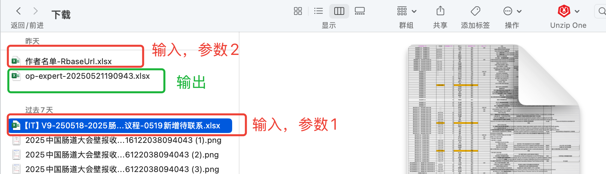
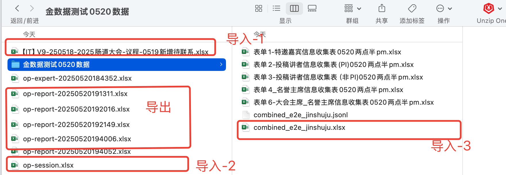

# 学术议程与金数据整合方案

## 背景介绍
在实际项目运行过程中，我们发现按照特定要求进行数据处理时常常面临各种挑战。为了提高工作效率并减少错误，特制定此数据处理标准方案，供团队成员参考执行。

**关键问题：**
> 运营人员往往不按照预设要求填写数据，因此我们需要建立专门的处理流程，以规范化运营团队自行维护的数据。

## 解决方案概述
项目数据来源主要有两部分：
1. 金数据平台收集的报告基本信息（包括报告标题、摘要等）
2. 运营团队单独维护的表格（包含报告时间、报告人信息等）

本方案旨在从这两个数据源提取并整合信息，最终转换为项目所需的Excel格式数据。

## 具体实施步骤

### 金数据数据处理
1. 从运营处获取一个金数据Excel表格的文件夹，例如：
   

2. 脚本 `e2e/jinshuju.py`

   **功能**：
   - 提取金数据中的报告基本信息
   
   **输入参数**：
   - 运营提供的一个金数据的Excel表格的文件夹路径，放了多个金数据的Excel表格
   - 例如：`/Users/zwy/Downloads/金数据测试0520数据`

   **输出文件**：
   - 生成一个新的Excel表格，命名为`combined_e2e_jinshuju.xlsx`
   - 生成一个JSONL文件，命名为`combined_e2e_jinshuju.jsonl`
   - 存放在输入文件夹下

   **脚本执行示例**：
   ```python
   python e2e/jinshuju.py '/Users/zwy/Downloads/金数据测试0520数据'
   ```

3. 导出信息字段包括：
   - 报告题目
   - 报告英文题目
   - 简介
   - 英文简介
  
### 运营数据处理-专家
1. 从运营处获取一个专家Excel表格的文件，例如：
   

2. 脚本 `e2e/op-expert.py`

   **功能**：
   - 提取专家信息，生成一个新的Excel表格
   
   **输入参数**：
   - 参数1：运营提供的一个Excel表格
   
   **输出文件**：
   - 生成一个新的Excel表格，命名为`op-expert-{时间戳}.xlsx`
   - 存放在输入文件夹下
   
   **脚本执行示例**：
   ```python
   python e2e/op-expert.py '/Users/zwy/Downloads/【IT】V9-250518-2025肠道大会-议程-0519新增待联系.xlsx'
   ```

3. 导出信息字段包括：
   - 分会场名称
   - 专家姓名
   - 第一Title
   - 主席类型
   - 主持人类型

### 运营数据处理-报告
1. 从运营处获取一个专家Excel表格的文件，例如：
   

2. 脚本 `e2e/op-report.py`

   **功能**：
   - 提取专家信息，生成一个新的Excel表格
   
   **输入参数**：
   - 参数1：运营提供的一个Excel表格
   - 参数2：分会场数据Excel，用这个Excel来补充开始时间，结束时间的日期【因为运营提供的表中没有日期，需求从分会场表里获取一下】【分会场名称、开始时间】
   - 参数3：金数据处理之后生成的报告的更多信息的Excel `combined_e2e_jinshuju.xlsx`，用这个Excel来补充报告的更多信息【报告题目、报告英文题目、简介、英文简介】
   
   **输出文件**：
   - 生成一个新的Excel表格，命名为`op-report-{时间戳}.xlsx`
   - 存放在输入文件夹下
   
   **脚本执行示例**：
   ```python
   python e2e/op-report.py '/Users/zwy/Downloads/【IT】V9-250518-2025肠道大会-议程-0519新增待联系.xlsx' '/Users/zwy/Downloads/op-session.xlsx' '/Users/zwy/Downloads/金数据测试0520数据/combined_e2e_jinshuju.xlsx'
   ```

3. 导出信息字段包括：
   - 分会场名称
   - 开始时间
   - 结束时间
   - 报告编码
   - 报告人姓名
   - 报告类型
   - 团队PI姓名
   - 报告题目
   - 报告英文题目
   - 简介
   - 英文简介

### 将数据放在项目input中
1. 将生成的`op-report-{时间戳}.xlsx`文件放在项目的`input/report`文件夹下
2. 将生成的`op-expert-{时间戳}.xlsx`文件放在项目的`input/expert`文件夹下
